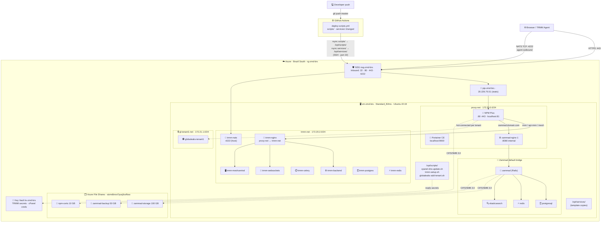

# Zammad — Azure VM Deployment

Bicep + Docker Compose deployment of [Zammad](https://zammad.org) on an Azure VM (Brazil South).
This repo is a fork of [zammad/zammad-docker-compose](https://github.com/zammad/zammad-docker-compose)
with Azure infrastructure, production overrides, and a full MSP stack layered on top.

> **Full ops guide:** see [CLAUDE.md](./CLAUDE.md)

---

## Architecture



NPM Plus is the single internet-facing HTTP/HTTPS entry point. NATS (port 4222) is TCP/TLS and bypasses NPM — agents behind NAT at client sites connect outbound with no client-side firewall changes needed.

---

## CI/CD

[`.github/workflows/deploy-scripts.yml`](.github/workflows/deploy-scripts.yml) runs on every push to `master` that changes `scripts/` or `services/`. It rsyncs both directories to the VM over SSH.

**What it touches:**

| Path on VM | Source | Notes |
|---|---|---|
| `/opt/scripts/` | `scripts/` | Executable shell scripts; `chmod +x` applied |
| `/opt/services/` | `services/` | Template compose files only; `.env` files excluded |

**What it never touches:** running stacks at `/opt/zammad/`, `/opt/npm/`, `/opt/portainer/`, `/opt/trmm/`. Scripts and service templates are reference files — no stack is restarted by the workflow.

**Required repository secrets** (Settings → Secrets and variables → Actions):

| Secret | Value |
|---|---|
| `VM_SSH_KEY` | Contents of `~/.ssh/zammad_azure` (private key) |
| `VM_HOST` | `20.226.75.51` |
| `VM_USER` | `zammadadmin` |

---

## Docker Networks

| Network | Subnet | Services |
|---|---|---|
| `proxy-net` | `172.20.0.0/24` | NPM Plus, Portainer, zammad-nginx, trmm-nginx |
| `trmm-net` | `172.20.2.0/24` | trmm-nginx (bridge) + all TRMM internal services |
| `gl-<tenant>-net` | `172.21.<n>.0/24` | One per GlobaLeaks tenant (fully isolated) |
| Zammad default | Docker-assigned | zammad, postgresql, redis, elasticsearch |

Both `proxy-net` and `trmm-net` are pre-created by `vm-setup.sh`. `trmm-nginx` is the only TRMM container on `proxy-net` — all others stay on `trmm-net` (no path to Zammad or tenant nets).

**Isolation rule:** tenant networks have no path to `proxy-net`, `trmm-net`, or each other. NPM Plus is hot-connected to each new tenant network via `docker network connect` — no restart needed.

---

## Services

| Path | Service | Network(s) |
|---|---|---|
| [`services/npm/`](services/npm/) | NPM Plus — reverse proxy + SSL | proxy-net |
| [`services/portainer/`](services/portainer/) | Portainer CE — Docker UI | proxy-net |
| [`services/trmm/`](services/trmm/) | Tactical RMM — remote monitoring & management | trmm-net (nginx also on proxy-net) |
| [`services/globaleaks/`](services/globaleaks/) | GlobaLeaks — **template** (per-tenant script) | gl-\<tenant\>-net |
| repo root | Zammad (upstream docker-compose) | proxy-net (nginx only) |

---

## Azure Resources

| Resource | Name | Detail |
|---|---|---|
| Resource Group | `rg-zmd-brs` | Brazil South |
| Virtual Machine | `vm-zmd-brs` | Standard_B2ms · 2 vCPU / 8 GB · Ubuntu 22.04 |
| OS Disk | — | Premium SSD · 64 GB |
| Public IP | `pip-zmd-brs` | `20.226.75.51` · Static · Standard SKU |
| VNet | `vnet-zmd-brs` | `10.0.0.0/16` |
| NSG | `nsg-zmd-brs` | Inbound: **22, 80, 443, 4222** |
| Storage Account | `stzmdbrsvi7puq3ozfbso` | Standard LRS |
| File Share | `zammad-storage` | 100 GB — attachments |
| File Share | `zammad-backup` | 50 GB — backups |
| File Share | `npm-certs` | 10 GB — NPM Plus certs + config |
| **Key Vault** | **`kv-zmd-brs`** | RBAC mode · TRMM secrets + cPanel API creds |

### Key Vault secrets (`kv-zmd-brs`)

| Secret | Contents |
|---|---|
| `trmm-secret-key` | Django `SECRET_KEY` |
| `trmm-postgres-pass` | TRMM PostgreSQL password |
| `trmm-mesh-pass` | MeshCentral admin password |
| `cpanel-host` | `http://daserie.com.br:2082` |
| `cpanel-username` | cPanel account for `nextlevelinfo.com.br` DNS |
| `cpanel-api-token` | cPanel UAPI token |

```bash
# Retrieve a secret
az account set --subscription 09a573e4-8b7e-4a95-8051-a21f01e0a758
az keyvault secret show --vault-name kv-zmd-brs --name <name> --query value -o tsv
```

---

## NPM Plus — Proxy Hosts

| Domain | Forward to | Port | SSL |
|---|---|---|---|
| `zammad.nextlevelinfo.com.br` | `zammad-nginx-1` | 80 | Let's Encrypt |
| `rmm.nextlevelinfo.com.br` | `trmm-nginx` | 80 | Let's Encrypt |
| `api-rmm.nextlevelinfo.com.br` | `trmm-nginx` | 80 | Let's Encrypt |
| `mesh.nextlevelinfo.com.br` | `trmm-nginx` | 80 | Let's Encrypt |

**Advanced → Custom Nginx config** (required on all 4 hosts — NPM Plus has no WebSocket toggle):
```nginx
proxy_http_version 1.1;
proxy_set_header Upgrade $http_upgrade;
proxy_set_header Connection "upgrade";
proxy_set_header Host $host;
proxy_set_header X-Real-IP $remote_addr;
proxy_set_header X-Forwarded-For $proxy_add_x_forwarded_for;
proxy_set_header X-Forwarded-Proto $scheme;
```

---

## Scripts

| Script | Deployed to VM by | Purpose |
|---|---|---|
| [`scripts/vm-setup.sh`](scripts/vm-setup.sh) | Bicep Custom Script Extension (first boot only) | Full VM bootstrap |
| [`scripts/cpanel-dns-update.sh`](scripts/cpanel-dns-update.sh) | GitHub Actions | Create/update TRMM DNS A records via cPanel UAPI |
| [`scripts/trmm-setup.sh`](scripts/trmm-setup.sh) | GitHub Actions | Deploy TRMM stack (run manually after DNS) |
| [`scripts/globaleaks-add-tenant.sh`](scripts/globaleaks-add-tenant.sh) | GitHub Actions | Provision isolated GlobaLeaks tenant |

---

## Quick Start

```powershell
# 1. Generate SSH key (first time only)
ssh-keygen -t ed25519 -C "zammad-azure" -f "$env:USERPROFILE\.ssh\zammad_azure"

# 2. Deploy infrastructure
az deployment sub create `
  --location brazilsouth `
  --name "zmd-$(Get-Date -Format 'yyyyMMddHHmmss')" `
  --template-file main.bicep `
  --parameters `
    sshPublicKey="$(Get-Content $env:USERPROFILE\.ssh\zammad_azure.pub)" `
    postgresPassword="YourSecurePassword123!"

# 3. Check setup log (~15 min after deploy)
ssh -i $env:USERPROFILE\.ssh\zammad_azure zammadadmin@20.226.75.51 'cat /var/log/zammad-setup.log'
```

### Deploy Tactical RMM (run once on VM after DNS propagates)

```bash
ssh -i ~/.ssh/zammad_azure zammadadmin@20.226.75.51

export APP_HOST=rmm.nextlevelinfo.com.br
export API_HOST=api-rmm.nextlevelinfo.com.br
export MESH_HOST=mesh.nextlevelinfo.com.br
export MESH_USER=meshcentral
export MESH_PASS=$(az keyvault secret show --vault-name kv-zmd-brs --name trmm-mesh-pass --query value -o tsv)
export POSTGRES_PASS=$(az keyvault secret show --vault-name kv-zmd-brs --name trmm-postgres-pass --query value -o tsv)
export SECRET_KEY=$(az keyvault secret show --vault-name kv-zmd-brs --name trmm-secret-key --query value -o tsv)

sudo -E bash /opt/scripts/trmm-setup.sh
```

### Update DNS after VM IP changes

```bash
sudo bash /opt/scripts/cpanel-dns-update.sh
```

---

## Syncing upstream Zammad

```bash
git fetch upstream
git merge upstream/master
# Accept upstream image versions on conflicts in docker-compose.yml
git add docker-compose.yml && git commit
```

See [CLAUDE.md](./CLAUDE.md) for the full ops guide: SSH tunnels, HTTPS setup, Intune/Entra ID agent deployment, GlobaLeaks tenant provisioning, TRMM Zammad integration, and troubleshooting.
