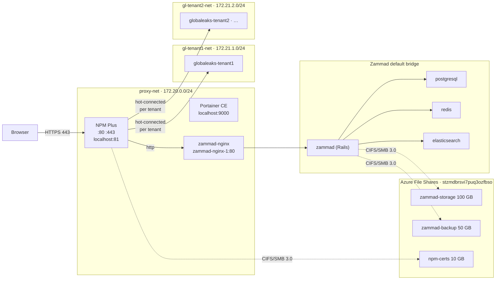

# Zammad — Azure VM Deployment

Bicep + Docker Compose deployment of [Zammad](https://zammad.org) on an Azure VM (Brazil South).
This repo is a fork of [zammad/zammad-docker-compose](https://github.com/zammad/zammad-docker-compose)
with Azure infrastructure, production overrides, and a multi-service setup layered on top.

> **Full ops guide:** see [CLAUDE.md](./CLAUDE.md)

---

## Architecture



NPM Plus is the single internet-facing entry point. GlobaLeaks tenants are deployed with [`scripts/globaleaks-add-tenant.sh`](scripts/globaleaks-add-tenant.sh), which auto-allocates a subnet and hot-connects NPM Plus without a restart.

---

## Docker Networks

| Network | Subnet | Services |
|---|---|---|
| `proxy-net` | `172.20.0.0/24` | NPM Plus, Portainer, zammad-nginx |
| `gl-<tenant>-net` | `172.21.<n>.0/24` | One per GlobaLeaks tenant (isolated) |
| Zammad default | Docker-assigned | zammad, postgresql, redis, elasticsearch |

`proxy-net` is pre-created by `vm-setup.sh`. Tenant networks are created on demand by `globaleaks-add-tenant.sh`, starting at `172.21.1.0/24` and incrementing. All compose files reference them as `external: true`.

**Isolation rule:** tenant networks have no path to `proxy-net` or to each other. NPM Plus is hot-connected to each new tenant network via `docker network connect` — no restart needed.

---

## Services

| Path | Service | Network |
|---|---|---|
| [`services/npm/`](services/npm/) | NPM Plus — reverse proxy + SSL | proxy-net |
| [`services/portainer/`](services/portainer/) | Portainer CE — Docker UI | proxy-net |
| [`services/globaleaks/`](services/globaleaks/) | GlobaLeaks — **template** (per-tenant) | gl-\<tenant\>-net |
| repo root | Zammad (upstream docker-compose) | proxy-net (nginx only) |

---

## Azure Resources

| Resource | Name | SKU |
|---|---|---|
| Resource Group | `rg-zmd-brs` | — |
| Virtual Machine | `vm-zmd-brs` | Standard_B2ms (2 vCPU / 8 GB) |
| OS Disk | — | Premium SSD, 64 GB |
| Storage Account | `stzmdbrsvi7puq3ozfbso` | Standard LRS |
| File Share | `zammad-storage` | 100 GB |
| File Share | `zammad-backup` | 50 GB |
| File Share | `npm-certs` | 10 GB |
| Public IP | `pip-zmd-brs` | Static, Standard SKU |
| VNet | `vnet-zmd-brs` | 10.0.0.0/16 |
| NSG | `nsg-zmd-brs` | Inbound: 22, 80, 443 |

---

## Quick Start

```powershell
# 1. Generate SSH key (first time only)
ssh-keygen -t ed25519 -C "zammad-azure" -f "$env:USERPROFILE\.ssh\zammad_azure"

# 2. Deploy
az deployment sub create `
  --location brazilsouth `
  --name "zmd-$(Get-Date -Format 'yyyyMMddHHmmss')" `
  --template-file main.bicep `
  --parameters `
    sshPublicKey="$(Get-Content $env:USERPROFILE\.ssh\zammad_azure.pub)" `
    postgresPassword="YourSecurePassword123!"

# 3. Check setup log (~15 min after deploy)
ssh -i $env:USERPROFILE\.ssh\zammad_azure zammadadmin@<vm-ip> 'cat /var/log/zammad-setup.log'
```

See [CLAUDE.md](./CLAUDE.md) for full instructions, first-login steps, HTTPS setup, troubleshooting, and adding new services.
